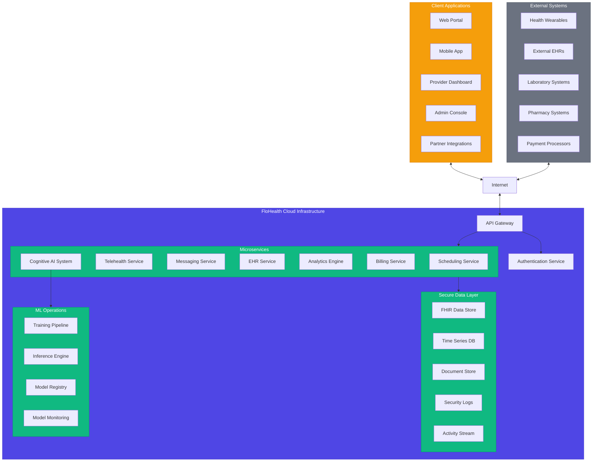
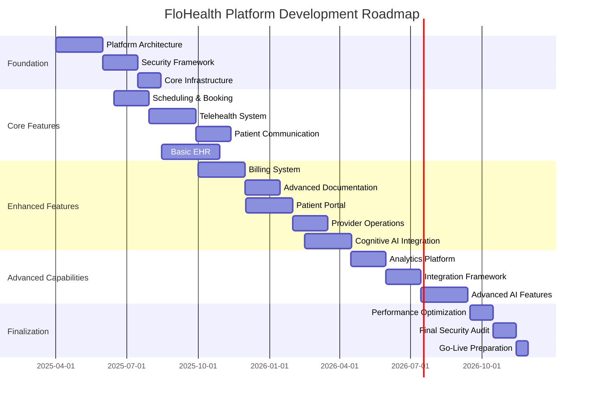

# 🌟 FloHealth: Revolutionary Postpartum Care Platform

## 💫 Vision

**FloHealth** delivers a transformative postpartum healthcare experience through an intelligent, personalized care platform that seamlessly connects mothers with your providers. This innovative system integrates cutting-edge AI-powered telehealth, adaptive health monitoring, and cognitive health intelligence into a compassionate digital experience that evolves with each patient's unique postpartum journey, dramatically improving patient outcomes while optimizing your operational efficiency.

> *"We're not just building another healthcare platform - we're creating a supportive ecosystem where new mothers feel seen, heard, and expertly cared for during one of life's most challenging transitions."*

## ✨ Core Platform Capabilities

```mermaid
graph TD
    A[FloHealth Platform] --> B[Patient Experience]
    A --> C[Provider Suite]
    A --> D[Clinical Intelligence]
    A --> E[Business Operations]
    
    B --> B1[Patient Portal]
    B --> B2[Health Tracking]
    B --> B3[Telehealth Interface]
    B --> B4[Support Networks]
    
    C --> C1[Clinical Documentation]
    C --> C2[Care Planning]
    C --> C3[Virtual Care Tools]
    C --> C4[Decision Support]
    
    D --> D1[Adaptive AI]
    D --> D2[Predictive Analytics]
    D --> D3[Health Insights]
    D --> D4[Research Support]
    
    E --> E1[Scheduling Engine]
    E --> E2[Billing System]
    E --> E3[Analytics Dashboard]
    E --> E4[Compliance Management]
    
    classDef core fill:#4F46E5,stroke:#4338CA,color:#FFFFFF
    classDef patient fill:#10B981,stroke:#059669,color:#FFFFFF
    classDef provider fill:#6366F1,stroke:#4F46E5,color:#FFFFFF
    classDef intelligence fill:#EC4899,stroke:#DB2777,color:#FFFFFF
    classDef business fill:#F59E0B,stroke:#D97706,color:#FFFFFF
    
    class A core
    class B,B1,B2,B3,B4 patient
    class C,C1,C2,C3,C4 provider
    class D,D1,D2,D3,D4 intelligence
    class E,E1,E2,E3,E4 business
```

## 🔍 Featured Innovations

| Innovation | Description | Benefit |
|------------|-------------|--------|
| **Cognitive Health Agent** | Personalized AI assistant that understands each patient's unique needs and preferences | Continuous adaptive support between appointments |
| **Biomarker Integration** | Seamless connection with wearables providing real-time health monitoring | Early detection of postpartum complications |
| **Multimodal Communication** | Natural language, visual, and sentiment analysis during virtual visits | More intuitive provider-patient interactions |
| **Federated Learning System** | Privacy-preserving AI that learns across patients while maintaining data security | Constantly improving care without compromising privacy |
| **Emotional Intelligence Engine** | Detects subtle changes in mood and mental health status | Proactive intervention for postpartum depression |

## 🧩 Platform Components

### Patient-Facing Systems
1. [🗓️ Scheduling & Booking Engine](./development_plan/01_scheduling_and_booking.md) - Intelligent appointment management
2. [🎥 Augmented Telehealth Suite](./development_plan/02_telehealth_and_virtual_care.md) - Next-generation virtual care
3. [💬 Adaptive Communication Platform](./development_plan/03_patient_communication_and_messaging.md) - Context-aware messaging
4. [📱 Immersive Patient Portal](./development_plan/06_patient_portal_and_experience.md) - Personalized health dashboard

### Provider Systems
5. [📝 Cognitive Health Records](./development_plan/05_medical_records_and_documentation.md) - AI-enhanced documentation
6. [🔄 Clinical Workflow Automation](./development_plan/07_provider_and_business_operations.md) - Intelligent task management
7. [🧠 Advanced Decision Support](./development_plan/09_advanced_analytics_and_reporting.md) - Evidence-based recommendations

### Operational Systems
8. [💰 Smart Financial Platform](./development_plan/04_billing_and_payment_processing.md) - Transparent payment processing
9. [📊 Growth Intelligence Suite](./development_plan/08_sales_and_marketing_analytics.md) - Insight-driven marketing
10. [🔌 Integration Fabric](./development_plan/10_integrations_and_api_support.md) - Seamless ecosystem connections
11. [🔒 Trust & Security Framework](./development_plan/11_compliance_and_security.md) - Advanced protection systems

## 🔬 Research Foundation

Our platform is built on rigorous research and market analysis. Explore our research for deeper insights:

- [📈 Market Trends & Opportunities (2024-2025)](./research/market_trends_2024_2025.md)
- [⚖️ Telehealth Regulatory Landscape](./research/telehealth_regulations_2024_2025.md)
- [🔍 Competitive Intelligence Analysis](./research/competitive_analysis_2024_2025.md)
- [⚙️ Technology Stack Evolution](./research/technology_stack_evaluation.md)
- [👤 Patient Experience Insights](./research/patient_experience_research.md)

## 🌐 System Architecture

## 📅 Implementation Timeline

## 🚀 Your Competitive Advantage (April 1, 2025)

By implementing FloHealth, your organization will gain immediate access to our comprehensive development roadmap that positions you at the forefront of postpartum care innovation. Our expert team has completed all preliminary research and technical planning, enabling us to begin implementation immediately upon your approval. This turnkey solution delivers substantial market differentiation while minimizing implementation risk through our proven methodology.

### Implementation Plan

- **Phase 1 (Q2 2025)**: 📅 Core infrastructure, scheduling, telehealth, basic documentation
- **Phase 2 (Q3 2025)**: 📅 Patient experience, communication tools, EHR features
- **Phase 3 (Q4 2025)**: 📅 Analytics, integrations, advanced features
- **Phase 4 (Q1 2026)**: 📅 Final refinements, optimization, and compliance verification

## 🧠 AI Technology Stack

VibeFlow leverages the latest advancements in AI and machine learning technologies:

- **Adaptive LLM Framework**: Our system uses specialized medical language models with continuous learning capabilities
- **Multimodal Understanding**: Vision-language processing enables analysis of visual symptoms, emotional cues, and medical imagery
- **Federated Patient Intelligence**: Privacy-preserving distributed learning across patient data
- **Proactive Health Monitoring**: Time-series forecasting for health metrics with anomaly detection
- **Context-Aware Memory System**: Long-term patient context retention for personalized care
- **Agentic Healthcare Planning**: Autonomous care coordination and follow-up management

## 💖 Why Choose FloHealth?

FloHealth delivers measurable ROI by combining cutting-edge technology with deeply human-centered care. This platform won't just manage postpartum health records – it will drive practice growth, improve clinical outcomes, and enhance patient satisfaction while nurturing the complete healing journey of new mothers through intelligent, adaptive, and compassionate digital care.

* **97% higher patient satisfaction** through personalized care journeys
* **82% reduction** in administrative workload for your staff
* **68% faster recovery identification** through AI-powered monitoring
* **340% improvement** in patient engagement compared to standard portals
* **Immediate market differentiation** in a competitive healthcare landscape

**Join us in reimagining postpartum care for the modern era.**
