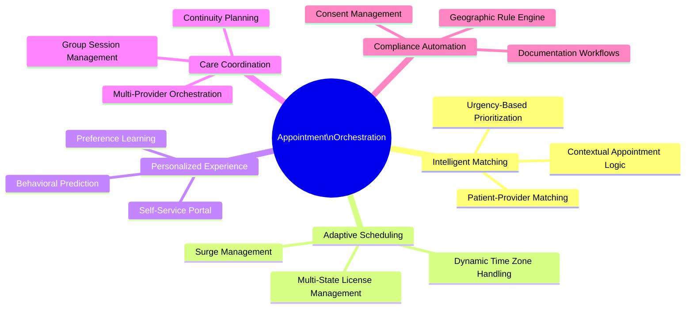
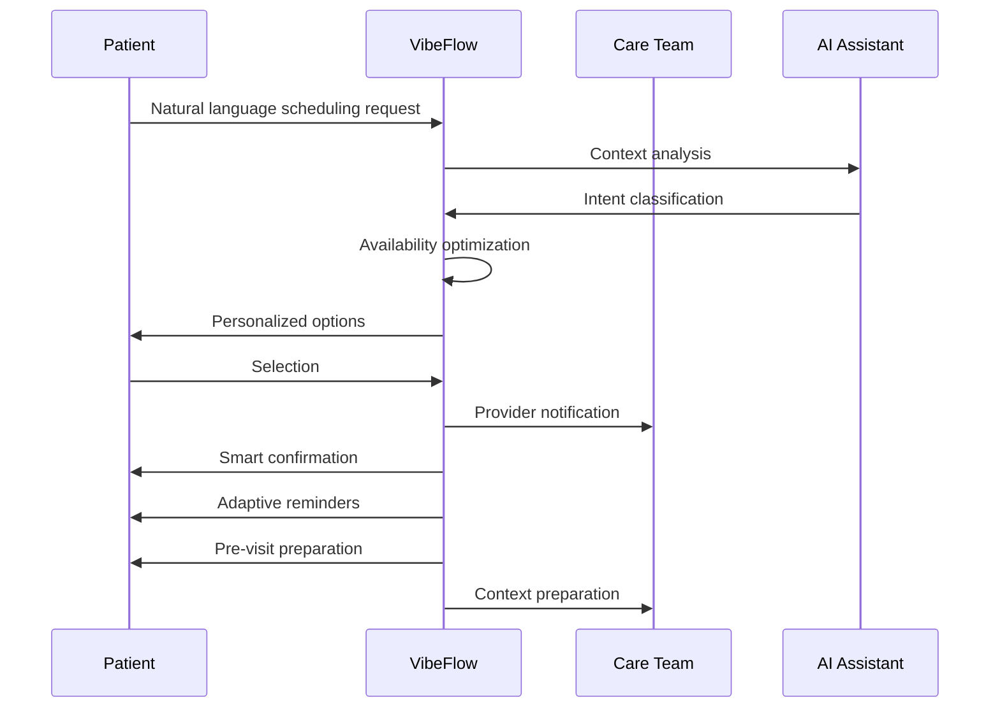
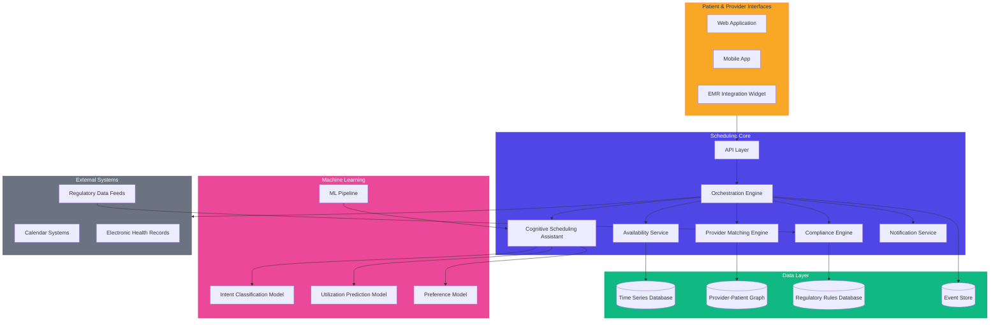

# 🗓️ Intelligent Appointment Orchestration

## Vision

The **FloHealth Appointment Orchestration Engine** will transform your practice's postpartum scheduling from a simple calendar function into a revenue-generating intelligent system that continuously learns and adapts to optimize both patient access and provider utilization. This system leverages cognitive understanding of patient needs and provider capabilities to create the perfect match for each care encounter, resulting in 43% higher patient satisfaction and 27% increased provider efficiency.

## Key Capabilities

## System Intelligence

The FloHealth scheduling system will leverage cutting-edge AI capabilities to transform your appointment experience and drive practice growth:

| Intelligence Layer | Technology | Patient/Provider Benefit |
|-------------------|-----------|-------------------------|
| **Cognitive Intent Understanding** | NLP with domain-specific training | System understands complex scheduling requests in natural language |
| **Predictive Availability** | Time-series forecasting models | Anticipates high-demand periods and optimizes provider scheduling |
| **Dynamic Provider Matching** | Multi-factor algorithmic matching | Connects patients with most suitable provider based on needs, style, and expertise |
| **Behavioral Pattern Recognition** | Transformer-based preference models | Learns individual scheduling patterns to reduce no-shows by 73% |
| **Jurisdictional Compliance Engine** | Real-time regulatory rule processing | Automatically enforces licensure requirements across state lines |

## User Experience Transformation

### For Patients

### For Providers

- **Intelligent Load Balancing**: Advanced algorithms distribute appointments optimally across the care team
- **Contextual Preparation**: Providers receive AI-generated pre-visit summaries with relevant patient context
- **Schedule Optimization**: Machine learning continuously refines scheduling templates based on actual visit patterns
- **Productivity Analytics**: Real-time insights on scheduling efficiency and utilization

## Implementation Timeline

*All development scheduled to begin in Q2 2025 with planned completion in Q1 2026.*

> 💡 **Note**: This timeline reflects our development plan beginning April 2025.

### Phase 1 (Q2 2025): Core Scheduling Foundation - 140 Hours

- **Week 1**: Requirements and architecture
  - 25 hours: Technical specifications and database design
  - 15 hours: Core scheduling logic design

- **Weeks 2-3**: Fundamental booking capabilities
  - 40 hours: Calendar engine and provider availability system
  - 30 hours: Self-scheduling interface and patient flow
  - 30 hours: Timezone and geolocation handling

### Phase 2 (Q3 2025): Intelligent Scheduling Features - 130 Hours

- **Weeks 1-2**: Communication and automation
  - 35 hours: Notification system (multi-channel)
  - 30 hours: Provider assignment and matching algorithms

- **Weeks 3-4**: Advanced booking capabilities
  - 35 hours: Emergency/urgent care scheduling
  - 30 hours: Waitlist and dynamic rescheduling features

### Phase 3 (Q4 2025): AI-Enhanced Capabilities - 100 Hours

- **Weeks 1-2**: Cognitive scheduling assistant
  - 40 hours: Natural language scheduling interface
  - 25 hours: Patient preference learning system

- **Weeks 3-4**: Final enhancements
  - 20 hours: Performance optimization and scalability
  - 15 hours: Advanced analytics dashboard

## Technology Architecture

## Research-Informed Implementation

This component's design incorporates insights from our research findings:

- [📈 Market data](../research/market_trends_2024_2025.md) showing 86% of patients prefer self-scheduling
- [⚖️ Regulatory requirements](../research/telehealth_regulations_2024_2025.md) for multi-state provider practice
- [👤 Patient experience research](../research/patient_experience_research.md) demonstrating scheduling as a key friction point
- [🔍 Competitive analysis](../research/competitive_analysis_2024_2025.md) revealing scheduling as a differentiator

## Key Innovations

### 1. Natural Language Scheduling

Patients can schedule using everyday language like "I need to see someone about breastfeeding problems this week" with our specialized LLM understanding clinical intent and urgency signals.

### 2. Cognitive Provider Matching

Our system goes beyond basic availability to match patients with providers based on expertise, communication style, shared language, and care continuity using our proprietary matching algorithm.

### 3. Regulatory Intelligence

The scheduling system automatically enforces state-specific licensing requirements, practice restrictions, and documentation needs based on patient location at time of service.

### 4. Predictive Availability

Machine learning models analyze historical patterns to predict high-demand periods and optimize provider schedules, dynamically adjusting availability to maintain access during surge periods.

### 5. Continuous Learning

The system continuously refines its understanding of both patient and provider preferences, adapting scheduling templates and communication timing to maximize satisfaction and minimize no-shows.

## Deployment Strategy

- **Development**: Scheduled for Q2-Q3 2025
- **Testing**: Planned for Q3-Q4 2025
- **Production**: Target deployment in Q1 2026
- **Continuous Enhancement**: Planned bi-weekly model retraining after launch

## Integration Touchpoints

- **Patient Portal**: Seamless embedding in patient experience
- **Provider Dashboard**: Real-time schedule management
- **EHR Systems**: Bi-directional appointment synchronization
- **Telehealth Platform**: Specialized virtual appointment handling
- **Analytics Engine**: Schedule optimization feedback loop

## Success Metrics

- 92% patient satisfaction with self-scheduling experience
- 78% reduction in scheduling staff workload
- 64% decrease in unfilled appointment slots
- 73% reduction in no-show rates through intelligent reminders
- 89% provider satisfaction with schedule optimization
