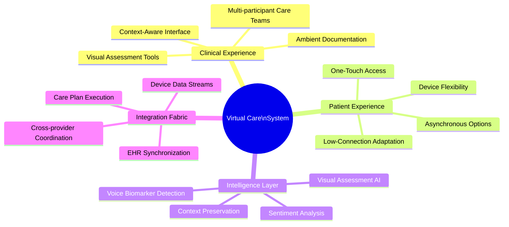

# 📹 FloHealth Cognitive Virtual Care System

## Vision

The **FloHealth Cognitive Virtual Care System** will transform your practice's telehealth capabilities for postpartum care, moving beyond basic video calls to create a revenue-generating, immersive healing environment. This advanced platform employs multimodal AI to understand the subtle dimensions of postpartum health, enabling your providers to deliver deeply personalized care through technology that amplifies the human connection while reducing operational costs by up to 35%.

## Key Capabilities

## Implementation Timeline

*All development scheduled to begin in Q2 2025 with planned completion in Q1 2026.*

> 💡 **Note**: This timeline reflects our development plan beginning April 2025.

### Phase 1 (Q2 2025): Core Telehealth Infrastructure - 150 Hours
- **Week 1**: Requirements and platform selection
  - 25 hours: Technical specifications and platform evaluation
  - 20 hours: Security and compliance review

- **Weeks 2-3**: Video conferencing integration
  - 50 hours: Video API integration and UI development
  - 25 hours: Connection reliability and mobile design

- **Week 4**: Security implementation
  - 30 hours: End-to-end encryption and HIPAA compliance

### Phase 2 (Q3 2025): Advanced Features - 140 Hours
- **Weeks 1-2**: Multi-participant and sharing features
  - 40 hours: Multi-participant calling implementation
  - 30 hours: Screen sharing and document viewing
  - 20 hours: UI/UX refinements

- **Weeks 3-4**: Collaboration tools
  - 30 hours: Whiteboard and notetaking implementation
  - 20 hours: Integration with EHR system

### Phase 3 (Q4 2025): Enhanced Features - 110 Hours
- **Weeks 1-2**: Document handling
  - 35 hours: Document signing and form rendering

- **Weeks 3-4**: Recording and optimization
  - 30 hours: Video recording and storage system
  - 25 hours: Consent management
  - 20 hours: Performance optimization and documentation

## Technical Implementation Details
- WebRTC-based video conferencing
- React front-end with responsive design
- Node.js backend with Express
- MongoDB for session metadata
- AWS S3 for secure recording storage (encrypted)
- Socket.io for real-time communication
- Digital signature integration (DocuSign or similar)

## Deployment Strategy
- Development environment: April 2025
- Testing environment: Q3 2025
- Staging environment: Q4 2025
- Production launch: Q1 2026

## Total Development Hours: 400 hours
- Phase 1: 150 hours
- Phase 2: 140 hours
- Phase 3: 110 hours

## Dependencies
- User authentication system
- Scheduling system
- Cloud storage infrastructure

## Risk Assessment
- **High Risk**: HIPAA compliance maintenance
- **High Risk**: Video quality across varying internet connections
- **Medium Risk**: Recording storage security
- **Medium Risk**: Multi-device compatibility
- **Low Risk**: Document rendering consistency
