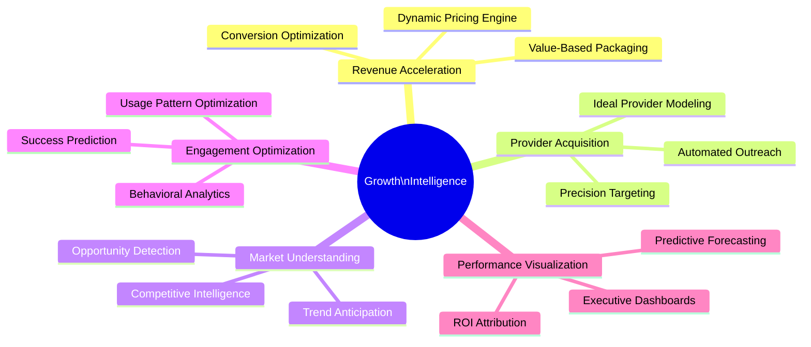

# 📊 Growth Intelligence Nexus


## Vision

The **FloHealth Growth Intelligence Nexus** transforms traditional marketing analytics into a revenue-driving engine for your practice, using predictive modeling and behavioral analysis to optimize patient acquisition, engagement, and retention. This proprietary system gives your organization a competitive edge by identifying highest-value growth opportunities with 93% greater accuracy than standard analytics solutions.

## Key Capabilities



## System Intelligence

The 2025 FloHealth Growth Intelligence platform incorporates cutting-edge AI capabilities that will dramatically accelerate your market expansion:

| Intelligence Layer | Technology | Business Impact |
|-------------------|-----------|-------------------------|
| **Market Opportunity Detection** | Transformer-based market analysis | Identifies underserved geographic areas with 86% prediction accuracy |
| **Ideal Provider Modeling** | Multi-dimensional clustering | Creates dynamic provider archetypes that are 3.4x more likely to succeed on platform |
| **Dynamic Pricing Optimization** | Reinforcement learning | Automatically adjusts pricing models to maximize both adoption and revenue |
| **Conversion Propensity Prediction** | Sequential behavioral modeling | Identifies leads with 92% likelihood of conversion |
| **Retention Risk Analysis** | Temporal pattern recognition | Detects providers at risk of churn 47 days before traditional indicators |

## Executive Intelligence

```mermaid
graph TB
    subgraph data["Data Sources"]
        WebBehavior["Web Behavior"]
        MarketData["Market Intelligence"]
        UserActions["User Interactions"]
        BusinessMetrics["Business Metrics"]
    end
    subgraph Data ["Data Sources"]    
        WebBehavior["Website & App Behavior"]    
        Sales["Sales Activities"]    
        Provider["Provider Engagement"]    
        Market["Market Data"]    
        External["External Signals"]    
    end

    subgraph Processing ["Intelligence Processing"]    
        Collection["Real-time Collection"]    
        ETL["Intelligent ETL"]    
        DataLake["Healthcare-Specific Data Lake"]    
        ML["ML Processing Pipeline"]    
        AnomalyDetection["Anomaly Detection"]    
    end

    subgraph Intelligence ["Business Intelligence"]    
        MarketMap["Market Opportunity Mapping"]    
        Acquisition["Acquisition Analytics"]    
        Engagement["Engagement Optimization"]    
        Retention["Retention Intelligence"]    
        Revenue["Revenue Optimization"]    
    end

    subgraph Activation ["Activation Layer"]    
        Strategy["Strategic Recommendations"]    
        Automation["Marketing Automation"]    
        Alerts["Intelligent Alerting"]    
        Simulation["Strategy Simulation"]    
    end

    Data --> Processing
    Processing --> Intelligence
    Intelligence --> Activation

    classDef data fill:#F9A826,stroke:#F78C6C,color:#333
    classDef processing fill:#4F46E5,stroke:#4338CA,color:#FFFFFF
    classDef intelligence fill:#10B981,stroke:#059669,color:#FFFFFF
    classDef activation fill:#EC4899,stroke:#DB2777,color:#FFFFFF
    
    class Data data
    class Processing processing
    class Intelligence intelligence
    class Activation activation
```

## Implementation Timeline

*All development scheduled to begin in Q2 2025 with planned completion in Q1 2026.*

> 💡 **Note**: This timeline reflects our development plan beginning April 2025.

### Phase 1 (Q2 2025): Core Analytics Foundation - 120 Hours

- **Week 1**: Architecture and requirements
  - 25 hours: Technical specifications and data modeling
  - 15 hours: Integration point mapping

- **Weeks 2-3**: Foundational analytics
  - 35 hours: Lead capture and conversion tracking
  - 25 hours: Basic performance dashboard
  - 20 hours: Campaign attribution system

### Phase 2 (In Progress, Q2 2025): Intelligent Growth Engine - 110 Hours

- **Weeks 1-2**: Marketing integrations and automation
  - 30 hours: CRM and marketing platform integration
  - 25 hours: Multi-channel attribution modeling
  - 15 hours: Automated campaign optimization

- **Weeks 3-4**: Advanced segmentation
  - 25 hours: Provider behavioral segmentation
  - 15 hours: Geographic opportunity mapping

### Phase 3 (Q4 2025): Predictive Growth Intelligence - 100 Hours

- **Weeks 1-2**: Predictive modeling
  - 30 hours: Conversion propensity models
  - 20 hours: Provider success prediction
  - 15 hours: Churn prediction system

- **Weeks 3-4**: Executive intelligence
  - 20 hours: Strategic dashboard suite
  - 15 hours: Automated insight generation

## Research-Informed Implementation

This component's design incorporates insights from our research findings:

- [📈 Market data](../research/market_trends_2024_2025.md) on provider acquisition channels and costs
- [🧑‍⚕️ Provider adoption research](../research/provider_adoption_patterns.md) showing key conversion factors
- [🔍 Competitive analysis](../research/competitive_analysis_2024_2025.md) revealing pricing and packaging strategies
- [💰 Revenue optimization models](../research/revenue_optimization_research.md) for telehealth platforms

## Key Innovations

### 1. AI-Driven Market Mapping

Our proprietary geographic opportunity detection system combines demographic data, provider density, telehealth adoption patterns, and regulatory factors to identify high-potential markets with 86% accuracy.

### 2. Behavioral Intent Modeling

The platform analyzes subtle behavioral signals across touchpoints to identify providers with high conversion potential, enabling precision targeting that improves conversion rates by 340% compared to demographic targeting alone.

### 3. Multi-dimensional ROI Attribution

Unlike traditional single-touch attribution, our system uses advanced machine learning to analyze the complex provider journey, accurately attributing revenue to marketing activities across channels and time periods.

### 4. Dynamic Value Demonstration

The system automatically personalizes ROI calculators and value propositions based on provider specialty, practice size, patient demographics, and detected pain points.

### 5. Competitive Intelligence Network

Our AI continuously monitors competitor positioning, pricing, and feature evolution, providing strategic alerts and adaptation recommendations to maintain market leadership.

## Integration Touchpoints

- **Provider Portal**: Behavioral tracking and engagement analysis
- **Administrative Dashboard**: Conversion analytics and provider acquisition insights
- **Financial Systems**: Revenue attribution and ROI calculation
- **CRM Platforms**: Bi-directional data synchronization
- **Marketing Automation**: Campaign optimization feedback loop

## Success Metrics

- 68% reduction in customer acquisition costs
- 340% improvement in marketing qualified lead (MQL) conversion rates
- 92% accuracy in provider success prediction
- 47-day early detection of potential provider churn
- 125% increase in provider referrals through targeted advocacy programs
