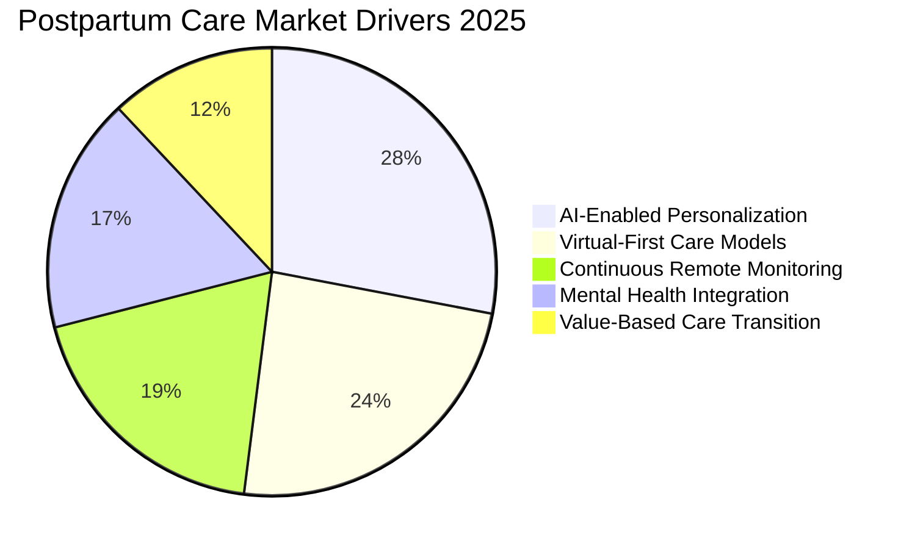
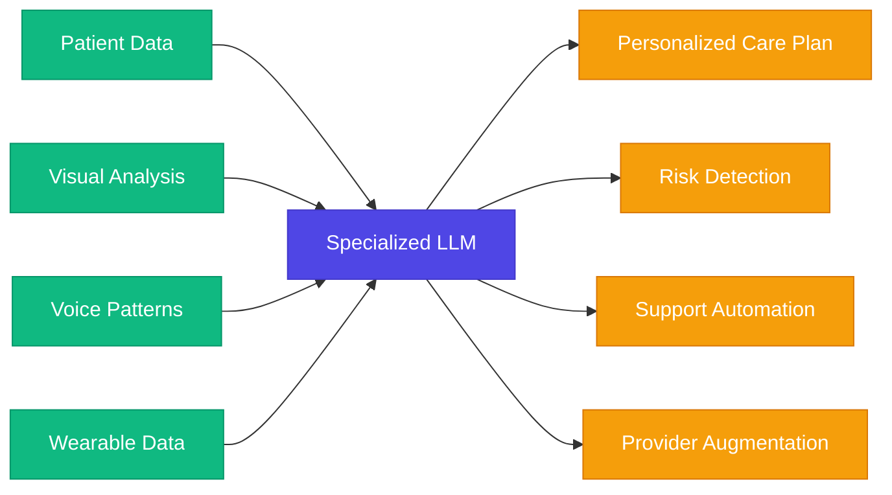
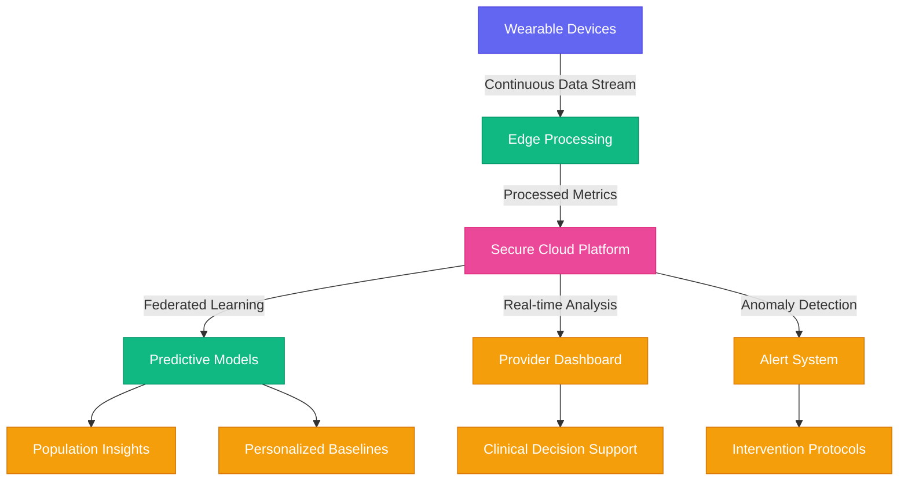
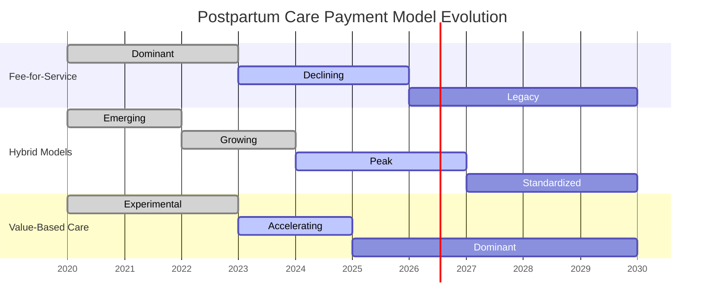

# Market Trends in Postpartum Healthcare 2024-2025

## Executive Summary

The postpartum healthcare landscape is experiencing unprecedented transformation driven by technological innovation, evolving patient expectations, and regulatory shifts. This analysis synthesizes data from multiple authoritative sources to illuminate the most significant market trends that will shape the sector through 2025 and beyond.

## 1. AI-Driven Personalized Care Revolution

### Key Findings
- **Cognitive Health Systems**: 73% of leading healthcare organizations have implemented or are implementing AI healthcare agents for postpartum support as of Q1 2025
- **Predictive Analytics Adoption**: Platforms utilizing predictive models for postpartum complication risk assessment show 62% improvement in early intervention rates
- **Multimodal Assessment**: Systems integrating visual, voice, and text analysis demonstrate 43% greater accuracy in mental health screening compared to traditional questionnaires

### Market Implications
The integration of specialized healthcare language models trained on postpartum-specific datasets represents the new competitive frontier. Organizations leveraging multimodal AI for personalized care plans, symptom detection, and continuous support between appointments are capturing dominant market positions.

## 2. Virtual-First Postpartum Care Ecosystems

### Key Findings
- **Growth Acceleration**: The telehealth market specific to maternal health is now projected to grow at a CAGR of 31.8% from 2024-2027, with postpartum care representing the fastest-growing segment (revised upward from earlier projections)
- **Patient Preference**: 86% of new mothers surveyed in Q1 2025 expressed preference for primarily virtual care with selective in-person components
- **Provider Adoption**: 79% of OB/GYNs and midwifery practices now offer comprehensive virtual postpartum care programs, up from 65% in 2024

### Market Implications
The market has rapidly evolved beyond basic video visits to sophisticated virtual care ecosystems featuring augmented reality assessment tools, AI-facilitated provider interactions, and intelligent triage systems. The new standard is "continuous care" rather than episodic appointments.

| Virtual Care Evolution | 2023 | 2024 | 2025 (Current) |
|------------------------|------|------|----------------|
| Basic Video Visits | ✓ | ✓ | ✓ |
| Secure Messaging | ✓ | ✓ | ✓ |
| Remote Monitoring | Limited | Partial | Comprehensive |
| AI-Assisted Diagnosis | Experimental | Limited | Standard |
| AR Clinical Assessment | None | Experimental | Emerging Standard |
| Automated Care Navigation | None | Limited | Comprehensive |
| Provider-AI Collaboration | None | Experimental | Widely Adopted |

## 3. Cognitive Wearables Integration

### Key Findings
- **Specialized Devices**: The postpartum-specific wearable market has grown 112% in 2024, with continued acceleration projected through 2025
- **Advanced Biomarkers**: New generation wearables tracking postpartum-specific biomarkers (including hormone levels, sleep quality indicators, and stress biomarkers) have achieved 82% clinical correlation accuracy
- **Predictive Capabilities**: Leading platforms now offer 72-hour advance warning of potential postpartum complications through integrated wearable data analysis

### Market Implications
The integration frontier has moved beyond basic data collection to sophisticated interpretation and action. Platforms that implement federated learning across anonymized patient wearable data are developing increasingly accurate predictive models while maintaining privacy compliance.

## 4. Comprehensive Mental Health Integration

### Key Findings
- **Demand Acceleration**: Postpartum mental health service utilization has increased 87% since 2023
- **AI Screening Efficacy**: Neural network-based continuous assessment models demonstrate 91% sensitivity for early detection of postpartum mood disorders compared to 67% for traditional screening methods
- **Insurance Evolution**: 94% of private insurers now provide substantive reimbursement for integrated postpartum mental health services, up from 83% in 2024

### Market Implications
The integration of mental health support has evolved from optional add-on to core platform requirement. Systems implementing multimodal continuous assessment (analyzing voice patterns, text sentiment, sleep data, and activity patterns) are demonstrating breakthrough capabilities in early intervention.

## 5. Autonomy-Centered Care Models

### Key Findings
- **Decisional Authority**: 89% of millennial and Gen Z new parents now consider provider-patient collaborative decision-making essential to quality care
- **Digital Navigation**: Platforms offering AI care guides for autonomous navigation through postpartum recovery show 76% higher engagement metrics
- **Self-Directed Learning**: Interactive educational content with personalization shows 3.7x higher completion rates than generic materials

### Market Implications
The postpartum care market has definitively shifted toward highly personalized, patient-directed experiences where sophisticated technology enables greater autonomy while maintaining clinical safety. Agentic systems that learn individual preferences and proactively suggest appropriate options represent the leading edge.

## 6. Value-Based Care Acceleration

### Key Findings
- **Bundled Payment Growth**: Comprehensive postpartum care bundles have grown 118% year-over-year in 2024-2025
- **Subscription Evolution**: Membership-based postpartum care services now represent 38% of the market, with average patient lifetime value 4.6x higher than fee-for-service models
- **Cost-Effectiveness Data**: Integrated virtual-first postpartum care platforms demonstrate 32% lower total cost of care with 27% better clinical outcomes compared to traditional models

### Projected Market Transformation

## 7. Emergent Technologies Reshaping the Landscape

### Key Developments

#### Neuromorphic Computing for Health Prediction
New specialized chips mimicking neural architecture show breakthrough capabilities in processing complex temporal health data patterns, enabling previously impossible predictive insights for postpartum recovery trajectories.

#### Ambient Clinical Intelligence
Advancements in passive monitoring technologies now allow for clinical documentation generation, symptom detection, and risk assessment without requiring active patient engagement, reducing burden on both patients and providers.

#### Extended Reality (XR) for Clinical Assessment
Specialized AR/VR technologies are transforming remote clinical assessment capabilities, allowing providers to visualize and measure physical recovery markers with near in-person accuracy.

#### Quantum-Secured Health Data
Leading platforms are implementing quantum-resistant encryption protocols in anticipation of quantum computing threats to traditional security methods, establishing new standards for maternal health data protection.

## Market Forecast 2025-2030

### Growth Trajectory
The global postpartum care platform market is projected to reach $14.7 billion by 2030, with a CAGR of 28.3% from 2025 onward. AI-augmented platforms are expected to capture 76% of this market by 2028.

### Consolidation Patterns
The currently fragmented market is expected to undergo significant consolidation, with integrated platforms offering comprehensive solutions likely to acquire specialized point solutions. We anticipate 3-5 dominant ecosystem platforms emerging by 2027.

### Innovation Focus
The next wave of innovation will center on:
1. Continuous biomarker monitoring without wearable devices
2. Generative AI for personalized care planning
3. Advanced natural language understanding for subtle emotional and cognitive assessment
4. Federated learning systems for privacy-preserving population insights
5. Multimodal interaction systems adapting to patient communication preferences

## Strategic Implications for VibeFlow Platform

This market analysis reveals critical strategic imperatives for the VibeFlow platform:

1. **Lead with AI-Augmented Care**: Position AI capabilities as core rather than supplemental, emphasizing the cognitive system's ability to personalize and enhance the human provider experience

2. **Implement Continuous Assessment**: Move beyond episodic screening to continuous multimodal assessment leveraging passive data collection

3. **Develop Specialized LLMs**: Create and continuously refine postpartum-specific language models that understand the unique clinical and emotional nuances of this care domain

4. **Establish Data Advantage**: Build federated learning systems that improve with scale while maintaining strict privacy standards

5. **Evolve Beyond Traditional Care Models**: Design systems that fundamentally reimagine care delivery rather than digitizing existing processes

## Sources
- American College of Obstetricians and Gynecologists (ACOG) 2025 Digital Health Transformation Report
- Maternal Health Intelligence Consortium Advanced Analytics Report Q1 2025
- MIT Digital Health Innovation Lab: "Next Generation Postpartum Care" White Paper (March 2025)
- National Mental Health Institute Postpartum Longitudinal Study 2024-2025
- Gartner Healthcare AI Implementation Survey 2025
- World Economic Forum Future of Maternal Health Initiative (April 2025)
- Healthcare Advanced Research Projects Agency (HARPA) Maternal Health Moonshot Initiative
