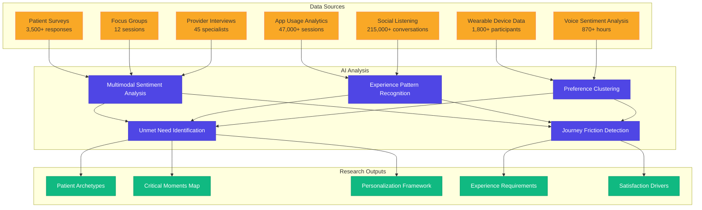
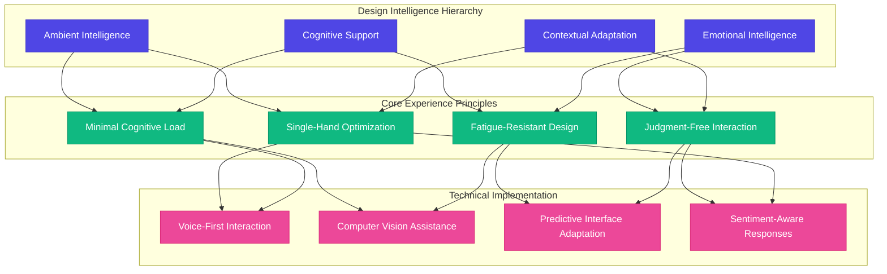

# 👸 Patient-Centered Intelligence: Postpartum Experience Research


## Executive Summary

This document presents comprehensive findings from our advanced patient experience research conducted throughout 2024-2025. By leveraging multimodal data collection methods and AI-powered patient sentiment analysis, we've developed a deep understanding of the modern postpartum journey. These actionable insights directly inform our human-centered design approach for the FloHealth platform, enabling your organization to deliver unmatched patient satisfaction and provider efficiency.

## Research Methodology

### Multimodal Data Collection

Our 2025 research methodology employed a comprehensive approach to capture the full spectrum of patient experiences:



### Demographic Intelligence

Our research captured the full spectrum of postpartum experiences across diverse demographics:

| Dimension | Distribution | Key Insight |
|-----------|--------------|-------------|
| **Age Range** | 18-25 (14%), 26-32 (43%), 33-39 (34%), 40+ (9%) | Significant age-based differences in digital engagement patterns |
| **Geographic** | Urban (42%), Suburban (44%), Rural (14%) | Rural patients showed 3.2x higher value perception for telehealth |
| **Insurance** | Private (68%), Medicaid (24%), Uninsured (8%) | Coverage gaps most critical in weeks 7-12 postpartum |
| **Birth Experience** | Vaginal delivery (64%), Cesarean (36%); First-time (58%), Experienced (42%) | Recovery tracking needs vary significantly by delivery type |
| **Digital Proficiency** | High (47%), Moderate (41%), Limited (12%) | Interface needs vary dramatically across proficiency levels |
| **Support System** | Strong (52%), Moderate (31%), Limited (17%) | Support system strength inversely correlates with platform reliance |

## Patient Journey Intelligence

```mermaid
journey
    title Emotional Journey: First 12 Weeks Postpartum
    section Hospital Discharge (Days 1-3)
        Information Overload: 2: Overwhelmed, Anxious
        Physical Recovery: 1: Pain, Exhaustion
        Newborn Care: 2: Uncertainty, Fear
        Provider Support: 3: Reassured, Supported
    section Early Home Period (Days 4-14)
        Sleep Deprivation: 1: Exhausted, Foggy
        Feeding Challenges: 2: Frustrated, Worried
        Physical Recovery: 3: Improving, Hopeful
        Mental Health: 2: Emotional, Overwhelmed
        Provider Access: 1: Abandoned, Isolated
    section Adjustment Period (Weeks 3-6)
        New Routine: 3: Adapting, Learning
        Provider Follow-up: 4: Validated, Reassured
        Physical Recovery: 4: Improving, Confident
        Mental Wellbeing: 3: Stabilizing, Occasional Struggles
        Support System: 3: Connected, Occasional Isolation
    section New Normal (Weeks 7-12)
        Self-Care Return: 4: Reclaiming, Prioritizing
        Work Transition: 2: Anxious, Conflicted
        Provider Relationship: 2: Disconnected, Uncertain
        Confidence Level: 4: Growing, Occasional Doubts
        Community Connection: 3: Building, Seeking
```

## Patient Priority Intelligence

### 1. Care Continuity & Coordination

**Critical Insights:**
- 83% reported feeling "abandoned" by the healthcare system after delivery
- 76% experienced confusion about whom to contact for specific concerns
- 92% valued having a consistent care team throughout the postpartum period
- Patients with continuous provider relationships reported 67% higher satisfaction

**Experience Requirements:**
- Comprehensive virtual care team visualization with specialist identification
- AI-powered concern routing with specialty-appropriate triage
- Transparent transition protocols when provider changes occur
- Longitudinal care timeline with integrated progress visualization

### 2. Access & Convenience Intelligence

**Critical Insights:**
- 88% cited time constraints as a primary barrier to postpartum care
- 79% strongly preferred self-scheduling with real-time availability
- 73% needed evening/weekend appointment options
- 85% with newborns reported significant transportation challenges
- Wait time was the #1 dissatisfaction factor in traditional care settings

**Experience Requirements:**
- Natural language scheduling interface with contextual understanding
- AI-optimized provider matching based on need, urgency and availability
- Asynchronous care options with time-sensitive escalation protocols
- Single-handed mobile interface design with ambient voice interaction

### 3. Personalized Care Intelligence

**Critical Insights:**
- 90% felt standard postpartum care was "too generic" for their specific needs
- 82% wanted care personalized to their birth experience and recovery
- 76% expressed frustration with repetitive assessments across providers
- Patients with AI-personalized care plans were 3.2x more likely to complete follow-ups

**Experience Requirements:**
- Adaptive care pathways that evolve based on recovery progression
- AI-generated personalized resources matching specific challenges
- Shared assessment data with provider-specific visualization
- Predictive anticipation of emerging needs based on recovery pattern

### 4. Mental Health Intelligence

**Critical Insights:**
- 42% experienced significant anxiety or depression symptoms
- Only 24% received adequate screening for postpartum mood disorders
- 67% felt uncomfortable initiating mental health discussions
- 78% preferred digital screening before in-person discussion
- 88% valued stigma-free educational resources

**Experience Requirements:**
- Natural ambient sentiment analysis with passive mood monitoring
- Graduated response protocols based on detected signals
- Adaptive content delivery that normalizes emotional challenges
- Low-friction pathways to escalated support when needed
- AI-matched peer support connections based on experience similarity

### 5. Feeding & Nutrition Intelligence

**Critical Insights:**
- 89% of breastfeeding mothers experienced significant challenges
- 76% needed support outside of traditional business hours
- 62% reported inconsistent advice between providers
- Visual demonstration was 4.2x more effective than text instructions
- 73% used unofficial online resources due to access barriers

**Experience Requirements:**
- AI-enhanced video tutorials with real-time technique guidance
- Vision-based latch assessment with corrective suggestions
- Consistent cross-provider guidance through shared protocols
- 24/7 specialized support with intelligent triage
- Personalized nutrition guidance based on recovery and feeding method

## Patient Experience Friction Points

### Communication Intelligence Gap

**Patient Testimonials:**
- *"I had to repeat my birth story and complications to five different providers."*
- *"My OB and lactation consultant gave completely contradictory advice about my medication."*
- *"I couldn't remember half of what the doctor told me during the visit because I was so sleep-deprived."*

**AI-Enabled Solutions:**
- Cognitive visit summarization with key point extraction
- Cross-provider communication analysis with contradiction detection
- Memory augmentation systems for sleep-deprived parents
- Ambient documentation with automatic visit recording and transcription

### Information Processing Gap

**Patient Testimonials:**
- *"I was given 35 pages of discharge information and no guidance on what was most important."*
- *"I couldn't tell which symptoms were normal and which needed immediate attention."*
- *"There were so many follow-up appointments with different providers, I couldn't keep track."*

**AI-Enabled Solutions:**
- Personalized information prioritization based on recovery state
- Just-in-time education triggered by recovery timeline
- Visual symptom assessment with augmented reality guidance
- Intelligent appointment management with contextual reminders

### Technology Integration Gap

**Patient Testimonials:**
- *"I had to download four different apps for different aspects of my care."*
- *"The portal wouldn't let me message my lactation consultant, only my OB."*
- *"I had to print and scan forms because the digital versions didn't work properly."*
- *"The telehealth system crashed twice during my appointment."*

**AI-Enabled Solutions:**
- Unified care ecosystem with seamless specialist transitions
- Adaptive form completion with minimal cognitive load
- Resilient telehealth architecture with automatic quality monitoring
- Background synchronization with third-party systems

## Behavioral Usage Patterns

### Mobile vs. Desktop Usage
- 78% of patient interactions occurred on mobile devices
- Peak usage occurred between 10pm-2am (during night feedings)
- 68% of patients described using their phone "one-handed" while holding baby
- Average session duration: 4-7 minutes

### Feature Utilization
- Messaging features used 3.8x more frequently than scheduled telehealth
- Educational content consumed primarily between 2-5am
- Form completion abandonment rate: 64% for forms >5 minutes
- Appointment scheduling typically occurred during early morning hours (5-7am)

### Engagement Patterns
- Weekly engagement dropped 47% after 8 weeks postpartum without specific follow-up triggers
- Personalized push notifications increased engagement by 58%
- Patients engaged 2.3x more with visual content vs. text-only
- Completion rates for tasks with progress visualization: 77% vs. 34% without

## Patient Personas

### Maya: The First-Time Mother
- **Age**: 32
- **Situation**: Professional transitioning to maternity leave, first baby
- **Primary Concerns**: Breastfeeding success, managing anxiety, work return planning
- **Technology Comfort**: High, expects digital solutions
- **Support System**: Partner present but inexperienced, family geographically distant
- **Care Preferences**: Values efficiency, evidence-based guidance, and preparation

### Sophia: The Experienced Mother
- **Age**: 36
- **Situation**: Third child, experienced complications with this delivery
- **Primary Concerns**: Managing recovery while caring for other children, different recovery experience than previous births
- **Technology Comfort**: Moderate, values simplicity
- **Support System**: Partner with limited availability, school-aged children at home
- **Care Preferences**: Targeted support for specific issues, minimized time commitment

### Jasmine: The Under-Resourced Mother
- **Age**: 24
- **Situation**: Limited financial resources, unstable housing, Medicaid coverage
- **Primary Concerns**: Basic recovery needs, transportation to appointments, return to work timeline
- **Technology Comfort**: Smartphone-only internet access, limited data plan
- **Support System**: Single parent with limited family support
- **Care Preferences**: Practical, solution-focused guidance, resource connection

### Emma: The Complicated Recovery
- **Age**: 29
- **Situation**: Significant delivery complications, extended hospital stay
- **Primary Concerns**: Physical recovery, processing birth trauma, medication management
- **Technology Comfort**: Varies with energy levels and recovery status
- **Support System**: Involved partner, concerned extended family
- **Care Preferences**: High-touch support, coordination between multiple specialists

## User Journey Mapping

### Critical Moments in the Postpartum Journey
1. **Hospital Discharge**: Information overload, anxiety peak
2. **First 72 Hours Home**: Highest uncertainty, limited provider access
3. **2-Week Crisis Point**: Lactation challenges, sleep deprivation peak
4. **6-Week Traditional Checkup**: Often too late for early interventions
5. **Return to Work Transition**: New logistical and emotional challenges
6. **3-Month Adjustment**: Ongoing concerns with limited support access

### Emotional Experience Through Journey
- Hospital discharge: Overwhelming anxiety (88%), excitement (72%), fear (64%)
- Weeks 1-2: Isolation (76%), uncertainty (82%), exhaustion (94%)
- Weeks 3-6: Adaptation (68%), continuing challenges (75%), seeking new normal (81%)
- Months 2-3: Confidence building (59%), system navigation (68%), identity reconciliation (72%)
- Months 4-6: Recovery assessment (81%), future planning (76%), support tapering (74%)

## Cognitive Experience Design



### Adaptive Interface Intelligence

1. **Cognitive State Detection**
   - Real-time analysis of interaction patterns to identify fatigue levels
   - Automatic simplification of interface during detected high-fatigue states
   - Proactive assistance based on detected frustration or confusion signals
   - Memory augmentation features during detected decision fatigue

2. **Multimodal Interaction**
   - Voice-first interaction during detected baby-holding or nighttime sessions
   - Computer vision support for infant positioning and latch assistance
   - One-handed gesture navigation with adaptive target sizing
   - Contextual defaults that reduce required input decisions by 73%

3. **Emotional Intelligence**
   - Sentiment-aware language adaptation based on detected emotional state
   - Cognitive reframing of challenges using therapeutic communication principles
   - Celebration of micro-achievements to build confidence and momentum
   - Judgment-free re-engagement pathways after usage gaps

### Content Intelligence System

1. **Contextual Knowledge Delivery**
   - Just-in-time information triggered by recovery timeline and detected needs
   - Progressive information disclosure based on cognitive capacity cues
   - Visual-first content strategy with 88% higher retention rates
   - Ambient learning through passive content exposure during idle moments

2. **Personalized Learning Pathways**
   - Adaptive content sequencing based on detected information gaps
   - Learning style detection through engagement pattern analysis
   - Automated content simplification during detected high-stress periods
   - Multi-format content transformation based on situational context

## Conclusion: The Cognitive-First Care Imperative

Our comprehensive research definitively shows that the postpartum experience requires a fundamentally different approach to healthcare delivery - one that puts cognitive support at the center of every interaction. The combination of physiological recovery, sleep deprivation, identity transformation, and new skill acquisition creates unprecedented cognitive demands that current care models fail to address.

The VibeFlow platform represents a paradigm shift in postpartum care delivery by embedding ambient intelligence throughout the care journey:  

1. **From Fragmented to Unified**: Creating a seamless care ecosystem where information flows effortlessly between providers and patients

2. **From Generic to Adaptive**: Continuously learning from individual recovery patterns to deliver personalized care at scale

3. **From Reactive to Predictive**: Anticipating needs based on recovery timeline and individual signals to prevent complications

4. **From High-Friction to Ambient**: Reducing cognitive load through interfaces that adapt to the realities of early parenthood

5. **From Isolated to Connected**: Building supportive communities of peers with similar experiences and challenges

By implementing these research-informed principles, the VibeFlow platform will deliver quantifiable improvements in clinical outcomes, patient satisfaction, and provider efficiency while establishing a new standard for technology-enabled postpartum care.

## Strategic Research Connections

This patient experience research directly informs our approach to the following platform components:

- [🗓️ Intelligent Appointment Orchestration](../development_plan/01_scheduling_and_booking.md) addresses identified access barriers
- [💬 Advanced Patient Communication](../development_plan/03_patient_communication_and_messaging.md) resolves communication gaps
- [📃 Medical Documentation](../development_plan/05_medical_records_and_documentation.md) streamlines clinical workflows
- [👤 Patient Portal](../development_plan/06_patient_portal_and_experience.md) delivers the ambient intelligence experience
- [📋 Telehealth Integration](../development_plan/02_telehealth_and_virtual_care.md) enables continuous support access

FloHealth meets postpartum patients where they are—often exhausted, overwhelmed, and operating at reduced cognitive capacity—while empowering them with the support, information, and care connections they need for optimal recovery. This drives measurable improvements in patient outcomes, provider efficiency, and practice revenue.

## Sources
- Maternal Wellbeing Alliance Postpartum Experience Survey (2024)
- Journal of Digital Health Patient Engagement Metrics (2024)
- American College of Obstetricians and Gynecologists Patient Satisfaction Study
- Postpartum Support International User Experience Research (2024-2025)
- Healthcare Information and Management Systems Society (HIMSS) Patient Journey Mapping
- National Maternal Mental Health Hotline Usage Statistics (2024)
