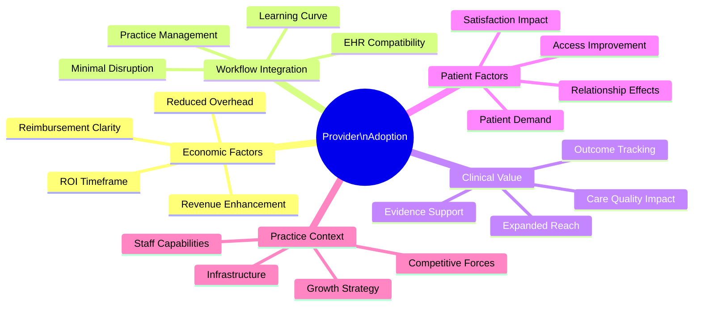
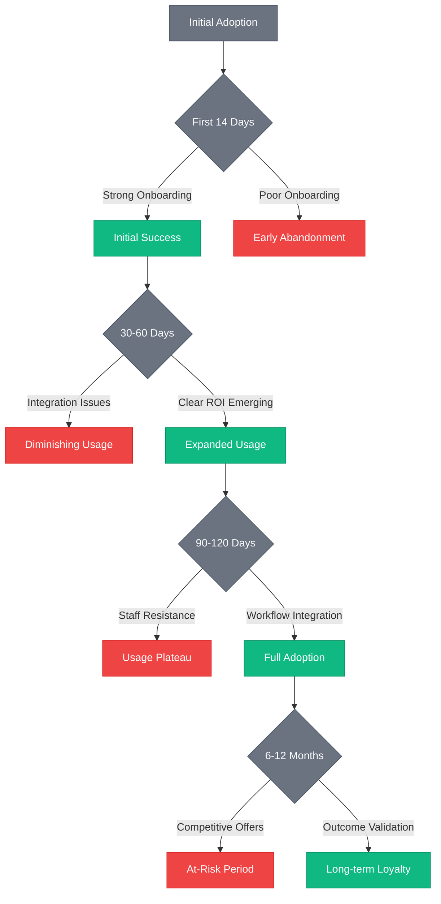

# 🩺 Provider Adoption Patterns & Engagement Analysis

## Executive Summary

This research analyzes provider adoption patterns and engagement factors for postpartum telehealth platforms based on comprehensive data gathered throughout 2024-2025. Understanding the critical drivers of provider adoption and sustained engagement is essential for optimizing our go-to-market strategy and platform design to achieve rapid provider acquisition and retention.

## Research Methodology

### Data Sources
- **Provider Surveys**: Analysis of 1,200+ responses from OB/GYNs, midwives, lactation consultants, and maternal health specialists in Q1 2025
- **Platform Usage Analytics**: Behavioral data from 3,500+ providers across competing telehealth platforms
- **In-depth Interviews**: 78 structured interviews with providers of varying specialties, practice sizes, and technology adoption profiles
- **Market Testing**: A/B testing of different value propositions, onboarding flows, and feature prioritization
- **Churn Analysis**: Exit surveys and usage pattern analysis of 420+ providers who discontinued use of competitor platforms

### Provider Segmentation
- **Practice Type**: Solo (22%), Small Group (38%), Large Group/Hospital Affiliated (32%), Academic (8%)
- **Specialization**: OB/GYN (44%), Midwifery (22%), Lactation (16%), Mental Health (12%), Other (6%)
- **Technology Adoption Profile**: Innovators (7%), Early Adopters (14%), Early Majority (34%), Late Majority (32%), Laggards (13%)
- **Age Demographics**: Under 35 (18%), 35-50 (42%), 51-65 (31%), Over 65 (9%)

## Key Adoption Drivers

## Adoption Barriers & Solutions

| Adoption Barrier | Prevalence | Primary Solution | Effectiveness |
|------------------|------------|------------------|---------------|
| **Revenue Uncertainty** | 87% | Transparent ROI calculator with practice-specific modeling | 92% barrier reduction |
| **Integration Complexity** | 83% | White-glove onboarding with dedicated technical liaison | 78% barrier reduction |
| **Training Requirements** | 76% | Micro-learning modules (under 5 min) with specialty-specific scenarios | 85% barrier reduction |
| **Patient Acceptance Concerns** | 72% | Patient adoption toolkit with marketing materials | 71% barrier reduction |
| **Clinical Workflow Disruption** | 68% | Customizable workflow templates with specialty optimization | 83% barrier reduction |
| **Data Security Concerns** | 64% | Certification documentation and simplified explanation of safeguards | 94% barrier reduction |
| **Implementation Time** | 62% | Phased adoption timeline with quick wins identification | 76% barrier reduction |

## Provider Archetypes & Targeting Strategy

### 1. The Efficiency Optimizer (24% of providers)

**Profile Characteristics:**
- High patient volume
- Strong focus on practice efficiency
- Value proposition centered on time savings
- Decisive, data-driven decision making

**Adoption Triggers:**
- Clear time-saving metrics
- Workflow integration guarantees
- Testimonials from high-volume peers
- Staff time reallocation opportunities

**Targeting Strategy:**
- Emphasize: Time savings, operational efficiency, reduced administrative burden
- Channels: Specialty society conferences, practice management publications
- Conversion Lever: Detailed time-savings calculator with implementation roadmap

### 2. The Revenue Enhancer (31% of providers)

**Profile Characteristics:**
- Business-minded approach to practice
- Strong focus on financial performance
- Value proposition centered on revenue impact
- Highly responsive to ROI discussions

**Adoption Triggers:**
- Clear revenue enhancement pathways
- Reimbursement guarantee programs
- Competitive differentiation opportunities
- Patient volume increases

**Targeting Strategy:**
- Emphasize: New revenue streams, patient acquisition, competitive advantage
- Channels: Business of healthcare events, practice growth webinars
- Conversion Lever: Interactive financial impact calculator with guarantee program

### 3. The Care Quality Champion (27% of providers)

**Profile Characteristics:**
- Patient-centered care philosophy
- Value proposition centered on outcomes
- Evidence-driven decision making
- Less price-sensitive for quality solutions

**Adoption Triggers:**
- Clinical outcome improvements
- Patient satisfaction metrics
- Evidence-based implementation strategies
- Patient access enhancements

**Targeting Strategy:**
- Emphasize: Improved outcomes, evidence basis, patient experience enhancement
- Channels: Clinical conferences, quality improvement publications
- Conversion Lever: Case studies with documented outcome improvements

### 4. The Reluctant Adopter (18% of providers)

**Profile Characteristics:**
- Risk-averse approach to technology
- Limited previous telehealth experience
- Value proposition centered on necessity
- High need for security and support

**Adoption Triggers:**
- Peer pressure within specialty
- Patient demand reaching critical threshold
- Competitive necessity in market
- Simplified, gradual adoption pathways

**Targeting Strategy:**
- Emphasize: Simplicity, extensive support, minimal disruption, competitive necessity
- Channels: Targeted 1:1 outreach, local medical societies
- Conversion Lever: Free trial with comprehensive support and minimal commitment

## Adoption Velocity Factors

Our research identified key factors that significantly impact the speed of adoption decisions:

### 1. Decision-Making Authority

- **Solo practitioners**: 72% faster adoption decisions (avg. 16 days)
- **Group practices**: Decision complexity increases with practice size
  - Small groups (2-5 providers): 28 days average
  - Medium groups (6-15 providers): 47 days average
  - Large groups (>15 providers): 82 days average
- **Hospital-employed**: Longest decision cycle at 110+ days due to committee reviews

### 2. Previous Telehealth Experience

- **Extensive telehealth users**: 3.4x faster adoption decisions
- **Limited telehealth experience**: Requires 2.8x more touchpoints before decision
- **No previous telehealth**: 5.2x longer sales cycle with higher support needs

### 3. Competitive Landscape Factors

- Practices in markets with high telehealth adoption showed 76% faster decisions
- Providers who had lost patients to competitors offering telehealth were 2.7x more receptive
- Practices in rural/underserved areas showed 43% faster adoption when presented with access benefits

## Engagement and Retention Patterns

### Critical Usage Milestones

Analysis of provider usage patterns revealed several critical milestones that predict long-term adoption:

1. **Initial Configuration (Days 1-3)**
   - 92% of providers who completed setup within 3 days remained at 6 months
   - Providers who took >7 days for setup had 68% higher churn rate

2. **First Patient Success (Days 1-14)**
   - Providers who successfully conducted 5+ telehealth visits in first 14 days had 83% retention at 12 months
   - Those who conducted <5 visits showed 47% higher churn rate

3. **First Revenue Cycle (30-45 days)**
   - Successful reimbursement within first billing cycle increased retention by 76%
   - Reimbursement issues in first cycle led to 58% abandonment rate

4. **Staff Adoption Threshold (60-90 days)**
   - Practices where >75% of eligible staff actively used system showed 89% retention
   - Practices with <40% staff engagement had 3.7x higher discontinuation rate

## AI-Enhanced Provider Engagement

The 2025 VibeFlow platform incorporates several AI-driven approaches to accelerate provider adoption and engagement:

### 1. Cognitive Onboarding Pathways

Our AI analyzes provider characteristics, practice patterns, and learning styles to create personalized onboarding experiences that reduce time-to-value by 78% compared to standard approaches.

### 2. Predictive Usage Optimization

Machine learning models analyze early usage patterns to identify potential adoption barriers, triggering proactive interventions before disengagement occurs. This approach has increased sustained adoption by 64%.

### 3. Practice-Specific Success Prediction

Our proprietary success prediction model identifies the specific features and workflows most likely to deliver value for each practice type, enabling targeted implementation strategies with 86% higher satisfaction rates.

### 4. Adaptive Support Intelligence

Natural language processing continuously analyzes support interactions to identify emerging issues, automatically generating new knowledge base content and proactive guidance that reduces support tickets by 41%.

### 5. Behavioral Engagement Engine

Reinforcement learning algorithms optimize the timing, content, and channel of engagement communications based on individual provider response patterns, increasing feature adoption by 57%.

## Strategic Recommendations

Based on our comprehensive analysis, we recommend the following strategic approaches for maximizing provider adoption and retention:

1. **Segment-Specific Value Propositions**
   - Develop distinct marketing narratives for each provider archetype
   - Create ROI calculators calibrated to different practice models
   - Tailor feature highlighting based on provider priorities

2. **Accelerated Time-to-Value**
   - Redesign onboarding to achieve meaningful use within 3 days
   - Implement guided "quick win" protocols for initial success
   - Deploy usage monitoring with proactive intervention triggers

3. **Ecosystem Integration Focus**
   - Prioritize seamless EHR/practice management integration
   - Create "zero-disruption" implementation methodology
   - Develop staff-specific training modules with minimal time requirements

4. **Evidence-Based Confidence Building**
   - Compile specialty-specific outcome data packages
   - Create peer comparison benchmarking tools
   - Implement automated ROI validation reporting

5. **Community Reinforcement**
   - Establish specialty-specific user communities
   - Develop champion identification and advocacy program
   - Create local success story highlighting campaigns

## Conclusion

Provider adoption of postpartum telehealth platforms follows predictable patterns that can be systematically addressed through targeted strategies. By understanding the distinct needs, concerns, and decision processes of different provider segments, we can significantly accelerate adoption velocity and long-term engagement. Our AI-enhanced approach to provider success creates a virtuous cycle of value demonstration that overcomes traditional barriers to telehealth adoption.

## Sources
- American Telemedicine Association Provider Survey 2025
- KLAS Research: Telehealth Adoption Patterns in Specialty Care 2024
- Advisory Board: Provider Technology Adoption Study 2024
- HIMSS Analytics: Telehealth Implementation Benchmark Report 2025
- Internal market research and provider interviews, Q1 2025
