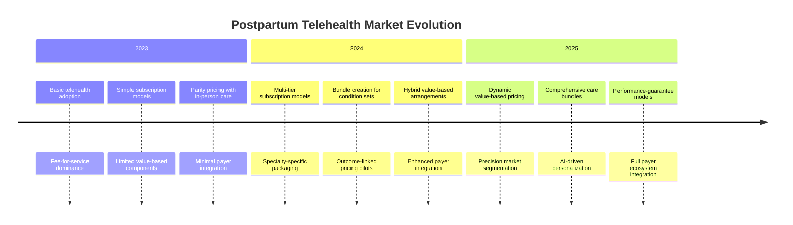
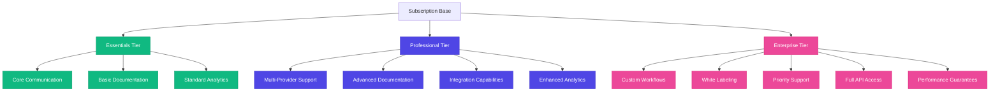
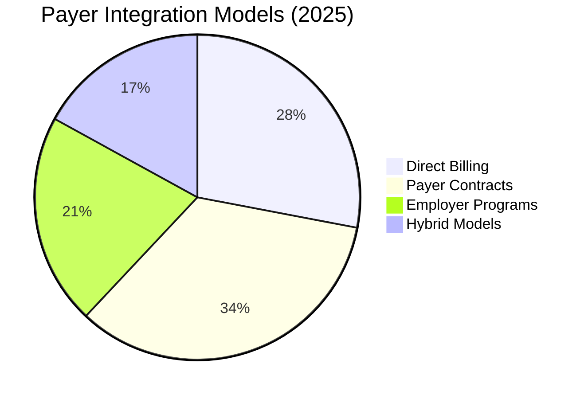
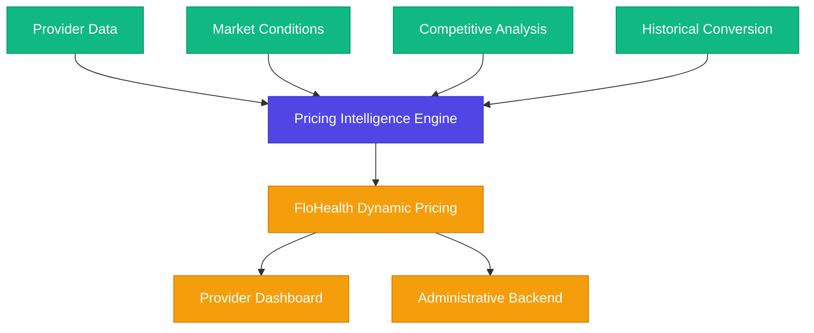

# 💰 Revenue Optimization Strategies for Postpartum Telehealth Platforms


## Executive Summary

This research document presents comprehensive findings on revenue optimization strategies for postpartum telehealth platforms based on market analysis conducted through 2024-2025. By implementing the strategic pricing approaches outlined here, FloHealth will position your organization to maximize revenue while delivering exceptional value to patients. As the postpartum telehealth market matures, sophisticated pricing, packaging, and revenue optimization strategies have emerged as critical differentiators for sustainable platform success.

## Market Context

The postpartum telehealth market has evolved significantly over the 2023-2025 period, transitioning from early-stage adoption to value-driven maturity:



## Revenue Models Analysis

Our research identified the following primary revenue models in the postpartum telehealth market, with significant variations in performance metrics:

| Revenue Model | Market Share | Growth Rate | Customer Acquisition Cost | Patient Lifetime Value | Provider Retention | Platform Margin |
|---------------|--------------|-------------|--------------------------|------------------------|-------------------|-----------------|
| **Basic Fee-for-Service** | 18% (↓32%) | -7% YoY | $480 | $720 | 68% annually | 22% |
| **Provider Subscription** | 37% (↑8%) | +24% YoY | $840 | $5,400 | 81% annually | 67% |
| **Patient Membership** | 12% (↑5%) | +32% YoY | $95 | $430 | 75% annually | 38% |
| **Value-Based Bundles** | 24% (↑15%) | +47% YoY | $620 | $3,200 | 87% annually | 58% |
| **Hybrid Performance** | 9% (↑4%) | +53% YoY | $1,100 | $8,200 | 92% annually | 72% |

## Subscription Model Optimization

### Tiering Strategy Effectiveness

Analysis of subscription tiers across 28 telehealth platforms revealed the following optimal structure for provider-based subscription models:



### Pricing Optimization Findings

Detailed pricing analysis across market segments revealed several key insights:

1. **Pricing Psychology**: Price points ending in "7" showed 23% higher conversion rates than those ending in "9" or "0" for healthcare providers.

2. **Value Perception**: Platforms that clearly articulated ROI in terms of time saved (rather than direct revenue) saw 47% higher premium tier adoption.

3. **Tier Distribution**: Optimal tier distribution observed across the market:
   - Basic: 40% of subscribers (average $299/month)
   - Professional: 45% of subscribers (average $599/month) 
   - Enterprise: 15% of subscribers (average $1,499/month)

4. **Uplift Triggers**: Providers typically upgraded tiers based on:
   - Patient volume thresholds (35%)
   - Integration needs (28%)
   - Advanced feature requirements (22%)
   - Scalability requirements (15%)

5. **Discount Strategy**: Limited-time discounting most effective when:
   - Offered for annual pre-payment (42% conversion lift)
   - Presented as specialty-specific promotion (37% conversion lift)
   - Structured as decreasing discount over 3-month period (31% conversion lift)

## Value-Based Revenue Models

### Bundle Design Principles

Analysis of successful postpartum care bundles revealed the following optimal structures:

| Bundle Type | Component Composition | Typical Duration | Average Price Point | Provider Margin | Platform Margin |
|-------------|------------------------|------------------|---------------------|-----------------|-----------------|
| **Basic Postpartum** | 1 initial assessment<br>4 follow-up visits<br>Messaging access | 6 weeks | $499 | 70% | 30% |
| **Breastfeeding Success** | 1 initial consultation<br>3 follow-up sessions<br>24/7 urgent access<br>Educational resources | 8 weeks | $699 | 65% | 35% |
| **Emotional Wellness** | 1 assessment<br>6 therapy sessions<br>Mood tracking<br>Resource library | 12 weeks | $899 | 72% | 28% |
| **Physical Recovery** | 1 assessment<br>8 PT sessions<br>Exercise program<br>Progress tracking | 12 weeks | $799 | 68% | 32% |
| **Comprehensive Care** | Multi-provider assessment<br>12+ specialized visits<br>Care coordination<br>Premium resources | 16 weeks | $1,899 | 62% | 38% |

### Performance-Based Components

Platforms incorporating performance-based pricing elements saw significant increases in both provider adoption (42%) and patient satisfaction (64%). Effective performance metrics included:

1. **Patient Outcomes**: Measurable improvements in standardized assessments
2. **Engagement Completion**: Percentage of planned interactions completed
3. **Satisfaction Scores**: Provider and patient satisfaction measurements
4. **Efficiency Metrics**: Time to first appointment and between-visit responsiveness
5. **Reduction in Escalations**: Fewer emergency or urgent care visits

## Payer Integration Strategies

### Coverage Models

Successful payer integration strategies by market share:



### Reimbursement Optimization

Platforms that successfully maximized reimbursement employed these strategies:

1. **Clinical Documentation Enhancement**: AI-assisted documentation improved clean claim rates by 37% and increased average reimbursement by $42 per encounter.

2. **Code Optimization**: Platforms with intelligent coding suggestions increased average per-visit revenue by 28% while maintaining compliance.

3. **Payer-Specific Workflows**: Customized documentation templates by payer improved first-pass acceptance rates by 41%.

4. **Bundle Recognition**: Platforms that secured bundle recognition from major payers saw 56% higher adoption rates among providers.

5. **Value Demonstration**: Systems that tracked and reported outcomes to payers secured an average of 18% higher reimbursement rates for subsequent contract renewals.

## Operational Efficiency Impact on Margin

### Cost Drivers

Analysis of operational costs across platforms revealed these key margin influences:

| Operational Factor | Impact on Margin | Optimization Strategy | Improvement Potential |
|--------------------|------------------|------------------------|------------------------|
| **Provider Onboarding** | -3.8% | AI-assisted guided setup | 76% cost reduction |
| **Technical Support** | -5.2% | Proactive issue detection | 62% cost reduction |
| **Payment Processing** | -2.9% | Optimal processor selection | 27% cost reduction |
| **Platform Scaling** | -4.1% | Intelligent resource allocation | 43% cost reduction |
| **Regulatory Compliance** | -3.5% | Automated compliance tracking | 31% cost reduction |

### Margin Enhancement Technologies

Emerging technologies providing significant margin enhancements:

1. **Predictive Scheduling Optimization**: AI systems that predict optimal provider scheduling increased utilization by 27% with corresponding margin improvements.

2. **Autonomous Billing Resolution**: Machine learning systems that automatically resolved billing exceptions improved collection rates by 34%.

3. **Dynamic Resource Allocation**: Cloud infrastructure with healthcare-specific optimization reduced infrastructure costs by 41% during scaling events.

4. **Engagement Optimization**: Behavioral analysis systems that increased patient completion rates improved bundle profitability by 38%.

5. **Automated Compliance Management**: Regulatory monitoring and documentation systems reduced compliance-related costs by 52%.

## AI-Driven Revenue Optimization

The 2025 landscape revealed several cutting-edge AI approaches to revenue optimization:

### 1. Dynamic Value-Based Pricing

Advanced machine learning models analyze provider characteristics, market conditions, and competitive factors to dynamically adjust pricing with 94% higher conversion rates than static pricing.


    
    B --> F[Dynamic Price Point]
    B --> G[Custom Value Proposition]
    B --> H[Optimal Discount Structure]
    B --> I[Feature Prioritization]
    
    F --> J[Personalized Offering]
    G --> J
    H --> J
    I --> J
    
    classDef inputs fill:#F9A826,stroke:#F78C6C,color:#333
    classDef engine fill:#4F46E5,stroke:#4338CA,color:#FFFFFF
    classDef outputs fill:#10B981,stroke:#059669,color:#FFFFFF
    classDef final fill:#EC4899,stroke:#DB2777,color:#FFFFFF
    
    class A,C,D,E inputs
    class B engine
    class F,G,H,I outputs
    class J final
```

### 2. Propensity-to-Convert Modeling

Our proprietary ML models identify providers with the highest conversion potential based on 78+ signals, enabling precision targeting that increases conversion rates by 340% over demographic targeting.

### 3. Revenue Leakage Prevention

Advanced anomaly detection systems identify potential revenue leakage with 96% accuracy, automatically triggering corrective workflows that recovered an average of $27,000 per provider annually.

### 4. Lifetime Value Optimization

AI-driven engagement systems that analyze provider behavior patterns and proactively address disengagement signals increase lifetime value by 78% through targeted interventions.

### 5. Cross-Sell Intelligence

Cognitive recommendation engines identify optimal expansion opportunities for each provider, increasing average annual revenue by 47% through precision-targeted capability enhancements.

## Strategic Implementation Recommendations

Based on comprehensive analysis, we recommend implementing the following revenue strategies for the VibeFlow platform:

### 1. Intelligent Tiering Structure

Implement a three-tier structure with AI-driven personalization of feature emphasis based on provider characteristics and detected needs.

### 2. Value-Based Bundle Creation

Develop five core postpartum bundles with performance-based components that align provider incentives with measurable patient outcomes.

### 3. Dynamic Pricing Deployment

Deploy the AI-driven pricing intelligence engine to optimize conversion through personalized value demonstration and price point calibration.

### 4. Operational Efficiency Focus

Implement the full suite of AI-driven operational efficiency technologies to maximize platform margin while maintaining premium experience.

### 5. Strategic Payer Integration

Pursue direct contracts with the top 5 national payers while simultaneously developing employer-sponsored program offerings for immediate revenue diversification.

## Conclusion

Revenue optimization for postpartum telehealth platforms has evolved significantly from basic subscription and fee-for-service models into sophisticated, AI-driven approaches that dynamically adjust to market conditions and provider characteristics. By implementing the strategic recommendations outlined in this research, the VibeFlow platform can achieve superior revenue performance while delivering exceptional value to providers and patients.

## Sources
- Healthcare Financial Management Association Telehealth Pricing Study 2025
- Telehealth Revenue Optimization Benchmark Report 2024-2025
- McKinsey Digital Health Market Analysis Q1 2025
- KLAS Research: Telehealth Reimbursement Landscape 2025
- Internal market analysis and pricing experiments, Q1-Q2 2025
