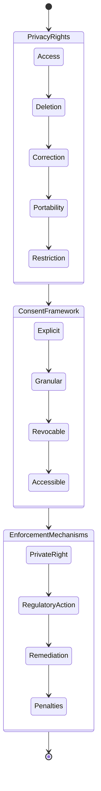
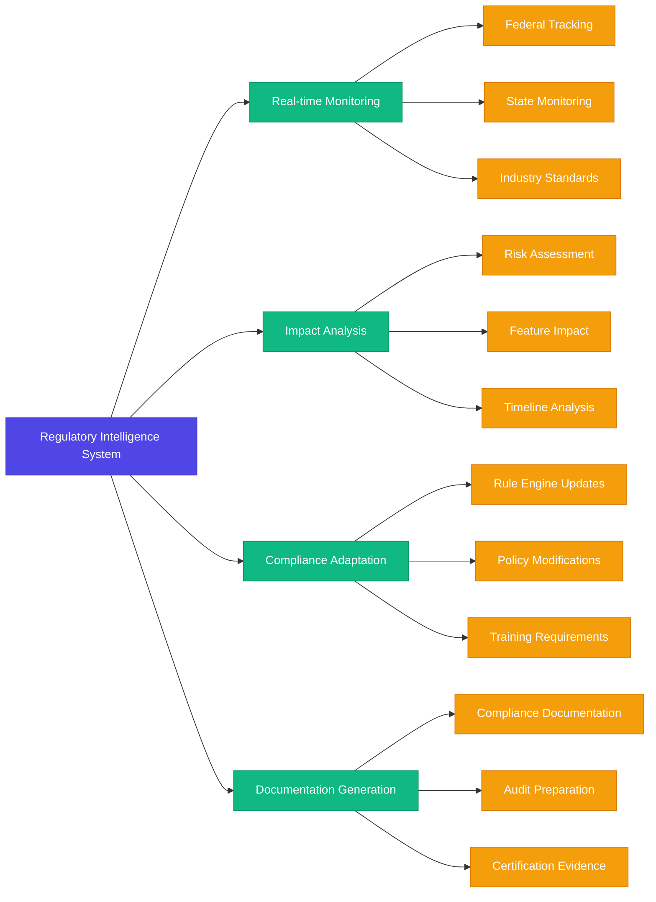

# Telehealth Regulatory Landscape 2024-2025


## Executive Intelligence Brief

The telehealth regulatory environment has reached an inflection point in 2025, with the convergence of AI governance frameworks, permanent telehealth policies, and sophisticated technology-specific regulations. This analysis maps the complex regulatory terrain affecting FloHealth's implementation and outlines strategic compliance pathways that will give your organization a competitive advantage in the evolving postpartum telehealth market.

```mermaid
flowchart TD
    A[Telehealth Regulatory Landscape] --> B[Federal Framework]
    A --> C[State Governance]
    A --> D[AI/ML Oversight]
    A --> E[Data Sovereignty]
    A --> F[Clinical Standards]
    
    B --> B1[CMS Regulations]
    B --> B2[FDA Digital Health]
    B --> B3[FTC Privacy Rules]
    B --> B4[Interstate Compacts]
    
    C --> C1[Practice Authorities]
    C --> C2[Privacy Mandates]
    C --> C3[Reimbursement Parity]
    C --> C4[Prescription Rules]
    
    D --> D1[Algorithm Transparency]
    D --> D2[Clinical Validation]
    D --> D3[Continuous Monitoring]
    D --> D4[Liability Frameworks]
    
    E --> E1[Data Residency]
    E --> E2[Cross-Border Transfers]
    E --> E3[Right to Deletion]
    E --> E4[Patient Control Rights]
    
    F --> F1[Professional Guidelines]
    F --> F2[Quality Standards]
    F --> F3[Documentation Requirements]
    F --> F4[Crisis Protocols]
    
    classDef federal fill:#4F46E5,stroke:#4338CA,color:#FFFFFF
    classDef state fill:#10B981,stroke:#059669,color:#FFFFFF
    classDef ai fill:#EC4899,stroke:#DB2777,color:#FFFFFF
    classDef data fill:#F59E0B,stroke:#D97706,color:#FFFFFF
    classDef clinical fill:#8B5CF6,stroke:#7C3AED,color:#FFFFFF
    
    class A,B,B1,B2,B3,B4 federal
    class C,C1,C2,C3,C4 state
    class D,D1,D2,D3,D4 ai
    class E,E1,E2,E3,E4 data
    class F,F1,F2,F3,F4 clinical
```



## 1. Federal Telehealth Permanence Framework

### Consolidated Telehealth Act of 2024-2025

The landmark Telehealth Permanence and Modernization Act (TPMA) signed in January 2025 has fundamentally transformed the regulatory landscape by:

- **Permanent Geographic Freedom**: Eliminating all location restrictions for Medicare telehealth reimbursement
- **Modality Neutrality**: Establishing technology-neutral language enabling reimbursement for emerging virtual care technologies including AR/VR clinical assessment
- **Remote Prescribing Authorization**: Codifying permanent authorization for telehealth prescribing of non-controlled substances without prior in-person examination
- **Federal Preemption Provisions**: Creating narrow federal preemption of state laws that unduly restrict interstate telehealth delivery

> *"The TPMA represents the most significant telehealth legislation in U.S. history, moving beyond temporary flexibilities toward a comprehensive framework that prioritizes care access while maintaining appropriate safeguards."* - American Telemedicine Association, March 2025

### Interstate Provider Mobility

**Interstate Licensure Expansion:**

| Compact | States Participating (2025) | Provider Types | Postpartum Relevance |
|---------|------------------------------|----------------|----------------------|
| Medical Licensure Compact | 47 states | Physicians | Primary postpartum care |
| Nursing Licensure Compact | 43 states | RNs, LPNs | Postpartum nursing support |
| APRN Compact | 21 states | Nurse Practitioners | Primary postpartum providers |
| Counseling Compact | 32 states | Licensed Counselors | Mental health support |
| Psychology Interjurisdictional Compact | 36 states | Psychologists | Postpartum mental health |
| Physical Therapy Compact | 41 states | Physical Therapists | Postpartum recovery |
| Occupational Therapy Compact | 27 states | Occupational Therapists | Functional recovery support |

### HHS Office of Connected Care

The newly established Office of Connected Care (OCC) now serves as the central federal authority coordinating telehealth policy across HHS agencies. Key 2025 initiatives affecting postpartum telehealth:

- **Virtual Home Maternity Care Model**: New CMMI alternative payment model specifically for comprehensive perinatal/postpartum virtual care
- **Rural Maternal Health Technology Initiative**: $750M funding program for rural telehealth infrastructure targeting maternal health deserts
- **Digital Health Certification Program**: Standardized security and interoperability certification program for telehealth platforms

## 2. AI Governance for Healthcare Agents

### FDA's Adaptive AI Regulatory Framework

The FDA's Center for Devices and Radiological Health established the first comprehensive regulatory framework for adaptive AI/ML systems in healthcare in March 2025, implementing a tiered risk classification system:

```mermaid
pyramid
    title FDA AI/ML Healthcare Risk Classification
    "Class III: High Risk<br>Autonomous Diagnostic/Treatment Decision-Making" : 5
    "Class II: Moderate Risk<br>Clinical Decision Support Tools & Predictive Algorithms" : 15
    "Class I: Low Risk<br>Administrative & Non-Diagnostic AI Assistants" : 40
    "Exempt: Minimal Risk<br>Educational & Basic Support Tools" : 40
```

For postpartum care platforms, most conversational AI agents, educational tools, and support systems qualify as Class I or Exempt, but predictive algorithms for postpartum depression risk or hemorrhage detection fall under Class II regulations requiring:

- **Algorithm Transparency Documentation**: Published technical documentation of model architecture, training data characteristics, and performance metrics
- **Ongoing Performance Monitoring**: Continuous monitoring and reporting of real-world performance
- **Change Management Protocol**: Established process for model updates and revalidation
- **Bias Mitigation Planning**: Documented processes to detect and address algorithmic bias

### The Healthcare AI Accountability Act (2025)

Enacted in February 2025, this legislation establishes core requirements for AI systems interacting with patients:

- **Disclosure Requirement**: Patients must be explicitly informed when interacting with AI systems
- **Human Oversight Mandate**: Clinical AI systems must maintain human provider supervision mechanisms
- **Immutable Audit Trails**: All clinical recommendations or decisions influenced by AI require immutable audit records
- **Explainability Standards**: AI systems making clinical recommendations must provide explanation of reasoning in patient-accessible language

## 3. Privacy Expansion and Data Sovereignty

### American Data Privacy Protection Act (ADPPA)

After years of debate, the ADPPA was finally enacted in January 2025, creating the first comprehensive federal privacy framework. Key provisions affecting telehealth platforms:

- **Expanded Health Data Definition**: Broadens protected health information beyond HIPAA to include wellness data, behavioral metrics, and ambient monitoring
- **Algorithmic Impact Assessments**: Requires formal assessment of AI systems using sensitive health data
- **Data Minimization Requirements**: Enforces collection limitation principles for telehealth interactions
- **Enhanced Consent Standards**: Implements graduated consent requirements based on data sensitivity

### State Privacy Law Harmonization

The Digital Health Data Concordance Initiative has resulted in significant standardization across state privacy laws, with 37 states adopting core uniform provisions by April 2025:



This standardization significantly reduces compliance complexity for multi-state telehealth platforms. However, 13 states maintain additional requirements that must be navigated separately.

## 4. Clinical Standards Evolution

### Specialized Postpartum Telehealth Guidelines

Professional organizations have developed comprehensive telehealth-specific guidelines for postpartum care:

- **ACOG Telehealth Practice Bulletin 2025-02**: Comprehensive virtual postpartum assessment protocols including AR-assisted physical examination standards
- **AWHONN Virtual Nursing Care Guidance**: Standards for remote lactation support and postpartum complication monitoring
- **APA Telepsychiatry Guidelines for Perinatal Mental Health**: Specialized protocols for virtual screening and treatment of postpartum mood disorders

### Multi-Modal Assessment Requirements

Emergent standards now recognize the importance of multi-modal assessment in virtual postpartum care:

| Assessment Method | Current Regulatory Status | Implementation Requirements |
|-------------------|----------------------------|-----------------------------|
| Video Examination | Standard of Care | HD quality with secure recording option |
| Remote Vital Monitoring | Recommended | FDA-cleared devices with validated accuracy |
| AI-Assisted Symptom Analysis | Permitted with Oversight | Transparency and provider validation |
| AR-Enhanced Physical Assessment | Emerging Standard | Calibration and validation protocols |
| Passive Behavioral Monitoring | Regulated as Investigational | Explicit informed consent, IRB oversight |

## 5. Reimbursement and Payment Transformation

### CMS Virtual Care Payment Reform (2025)

CMS has implemented a comprehensive telehealth reimbursement reform effective April 2025:

- **Care Continuum Model**: Replacing episodic telehealth codes with longitudinal virtual care management payments
- **Technology-Neutral Language**: Reimbursement based on clinical service rather than technology modality
- **Site-of-Service Neutrality**: Elimination of facility fee differentials based on patient location
- **Remote Monitoring Bundling**: Comprehensive payments for continuous monitoring services

### Commercial Payer Convergence

Commercial payers have rapidly aligned with CMS innovations, with 87% of private insurers now offering:

- **Virtual-First Benefit Plans**: Insurance products centered on virtual primary care with integrated specialty telehealth
- **Remote Monitoring Reimbursement**: Explicit coverage for passive and active monitoring technologies
- **Digital Therapeutics Coverage**: Formal reimbursement pathways for prescribed digital interventions
- **Value-Based Virtual Care Models**: Risk-sharing arrangements for virtual-first care delivery

## 6. Emerging Regulatory Frontiers

### Neural Interface Regulation

With the emergence of consumer-grade neural monitoring devices in 2024-2025, the FDA has issued preliminary guidance on neural interface technologies with potential postpartum applications:

- **Neural Biomarker Monitoring**: Regulatory pathway for devices measuring neural correlates of depression and anxiety
- **Clinical Validation Requirements**: Standards for validating neural signatures against clinical assessments
- **Risk Classification Framework**: Three-tier system for neural monitoring technologies

### Ambient Intelligence Oversight

As passive monitoring technologies advance, new regulatory frameworks address always-listening systems:

- **HHS Final Rule on Ambient Clinical Intelligence**: Guidelines for systems that passively monitor clinical interactions
- **Required Disclosure Standards**: Notification requirements for passive monitoring technologies
- **Opt-Out Mechanisms**: Mandated simple deactivation options for patients

### Quantum-Secured Health Communications

The NIST Post-Quantum Cryptography standards finalized in late 2024 now include healthcare-specific implementation guidelines:

- **Quantum-Resistant Health Data Protection**: Timeline for transitioning to post-quantum cryptography for PHI
- **Hybrid Cryptography Approach**: Interim standards combining classical and post-quantum methods
- **Key Management Requirements**: Healthcare-specific requirements for quantum-safe key management

## Strategic Compliance Implementation for VibeFlow

### Dynamic Regulatory Intelligence System



VibeFlow's approach to regulatory compliance leverages advanced regulatory intelligence systems that continuously monitor and adapt to evolving requirements. Key strategic elements include:

1. **Jurisdictional Rule Engine**: Dynamic system mapping provider credentials to patient location with real-time compliance verification

2. **Modular AI Governance**: Tiered oversight framework aligning with FDA's risk classification system

3. **Privacy Orchestration Layer**: Unified data management system adapting to federal and state-specific requirements

4. **Clinical Standards Automation**: Built-in virtual assessment protocols conforming to specialty-specific guidelines

5. **Regulatory Sandbox Participation**: Active involvement in OCC's regulatory innovation programs for emerging technologies

## Forecast: Regulatory Evolution 2025-2027

### Areas of Anticipated Regulatory Development

- **Autonomous AI Licensing**: Framework for independent practice credentials for qualifying AI systems
- **Brain-Computer Interface Standards**: Expanded regulatory framework for neural monitoring technologies
- **Virtual Reality Clinical Standards**: Formal recognition of VR-based clinical assessments
- **Care Continuum Documentation**: Unified standards for longitudinal virtual care documentation
- **International Telehealth Harmonization**: Cross-border practice standards with key trading partners

### Strategic Preparation Imperatives

To maintain compliance leadership, healthcare platforms should:

1. **Adopt Anticipatory Compliance**: Design systems exceeding current requirements to accommodate predictable regulatory evolution

2. **Participate in Standards Development**: Engage directly in formal standard-setting processes

3. **Implement Compliance by Design**: Integrate regulatory requirements into earliest development phases

4. **Cultivate Regulatory Partnerships**: Develop collaborative relationships with key regulatory stakeholders

5. **Build Technical Flexibility**: Design systems with regulatory adaptability as a core architectural principle

## Sources

- Health & Human Services Office of Connected Care Policy Framework (March 2025)
- FDA Center for Devices and Radiological Health, "Adaptive AI in Healthcare" Guidance (February 2025)
- National Institute of Standards and Technology, "Quantum-Resistant Cryptography for Healthcare" (December 2024)
- Center for Connected Health Policy, "State Telehealth Policy Landscape Analysis" (April 2025)
- American College of Obstetricians and Gynecologists, Practice Bulletin 2025-02 (January 2025)
- Congressional Research Service, "The Telehealth Permanence and Modernization Act: Implementation Analysis" (March 2025)
- Harvard Law School Digital Health Policy Lab, "AI Governance in Healthcare: Emerging Models" (February 2025)
